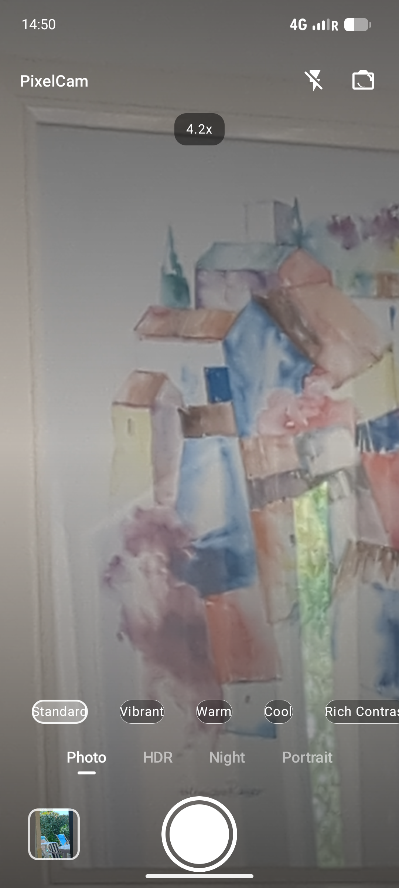

# PixelCam

An Android camera app that takes better pictures, especially on Pixel phones.
It mimics the "latest generation" iOS camera feel with built-in photographic
styles (color grading) and real on-device scene modes powered by the CameraX
vendor extensions found on Pixel devices.



## Features

- **iOS-style photographic styles** — Standard, Vibrant, Warm, Cool, Rich
  Contrast and Mono applied as subtle color grading. Styles are shown live on
  the preview before you shoot.
- **HDR mode** — multi-exposure high dynamic range via the CameraX extension.
- **Night mode** — low-light multi-frame enhancement via the CameraX extension.
- **Portrait mode** — subject-in-focus background bokeh via the CameraX BOKEH
  extension.
- **Pinch-to-zoom** with double-tap to reset.
- **Smart default processing** — a punch (saturation + contrast + a hint of
  warmth) applied to every shot by default.
- **Auto-save** — every photo is saved straight to `DCIM/Camera`, no
  confirmation needed.
- Front / back camera switch and flash toggle.

> HDR / Night / Portrait are always selectable. On devices without the vendor
> extensions (only Pixel and a few others implement them), the app falls back
> to a regular high quality capture.

## Getting the APK

The repo builds **debug** APKs automatically with GitHub
Actions. The release APK is signed with a debug key so it installs normally.

1. Open the **Release** tab of this repository.
2. Download the app-debug.apk artifact and install the APK of your choice
   (allow "install from unknown sources").

## Building locally

Requirements: JDK 17 and an Android SDK.

```
./gradlew assembleDebug
```

The APK is written to `app/build/outputs/apk/debug/`.

## How it works

- `CameraController` binds CameraX `Preview` + `ImageCapture`. For HDR / Night /
  Portrait it queries `ExtensionsManager` and binds the extension-enabled
  camera selector, which activates the Pixel vendor extension for that mode.
- `PhotographicStyle` defines each style as a combination of color matrices
  (saturation, contrast/brightness and warm/cool tint) — the same technique
  iOS "Photographic Styles" use under the hood.
- After capture, `PhotoProcessor` re-encodes the image with the selected style
  and inserts it into `MediaStore`.

## License

Apache-2.0
